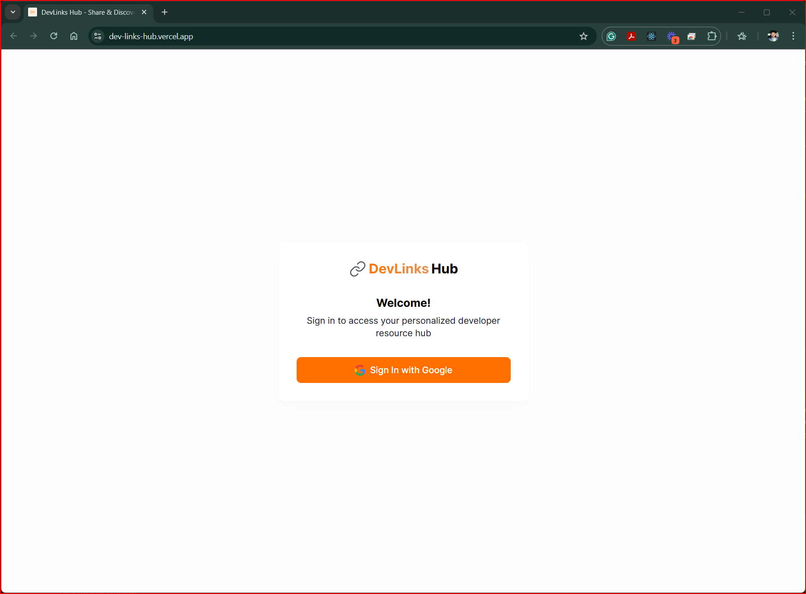
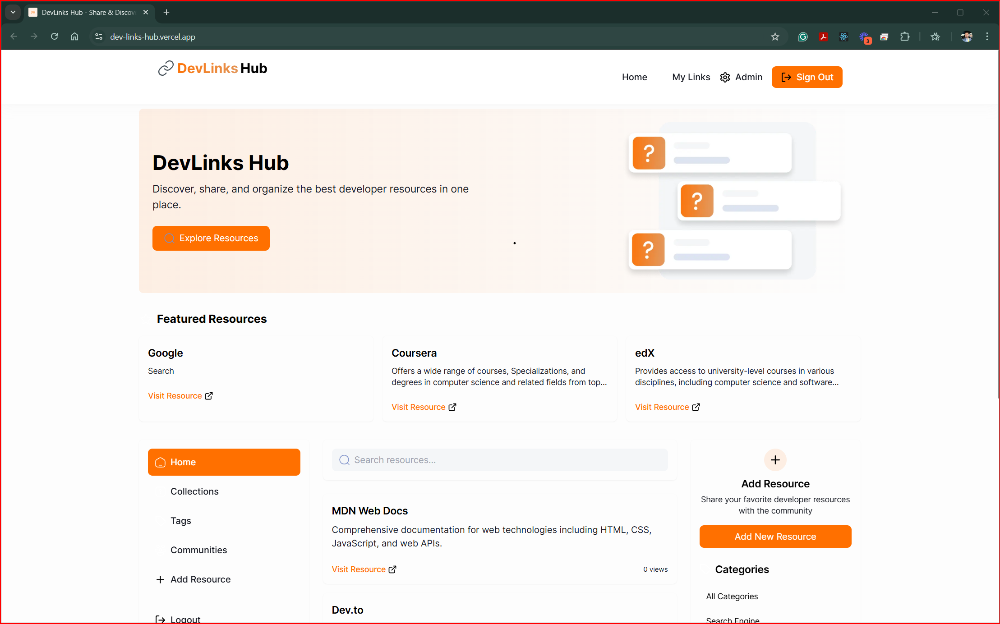
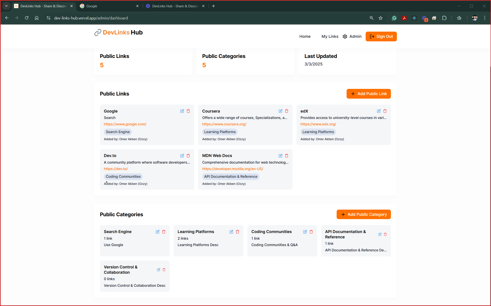

# DevLinks Hub

## Overview
DevLinks Hub is a centralized platform for developers to discover, share, and organize valuable programming resources. The application allows users to create personal collections of developer resources and explore content shared by the community, making it easier to find helpful tools, tutorials, and documentation.

## Quick Links
- [Live Demo](https://dev-links-hub.vercel.app/)
- [Wireframes/Prototype](https://www.figma.com/design/1Hho9zZfAQgsqhB7kAAa1x/DevLinks-Capstone?node-id=0-1&t=kTE0wsSQUuruCZiP-1)
- [Project Board](https://github.com/users/omerakben/projects/12)
- [Loom Video](https://www.loom.com/share/b0dc10a0586b47c0b88055a9b37e999d?sid=7abe874e-3ff6-4418-955a-3e681d2111ca)


## DevLinks Hub is inspired from StackOverflow:
- **Junior Developers** Omer (Ozzy) Akben

## Features

### User Features
- **Authentication**: Sign in with Google
- **User Dashboard**: Manage your personal collection of developer resources
- **Link Management**: Add, edit, and delete links to developer resources
- **Category Management**: Organize your links by categories
- **Public Resources**: Discover resources shared by others
- **Search Functionality**: Find resources quickly by title, description, or tags
- **Responsive Design**: Access from any device with a consistent experience
- **Theme Toggle**: Switch between light and dark mode based on preference

### Admin Features
- **Admin Dashboard**: Manage public resources for all users
- **Public Link Management**: Add, edit, and delete public links
- **Public Category Management**: Organize public links by categories
- **User Management**: View and manage user accounts

### Technical Features
- **Responsive Design**: Works on all devices
- **Dark/Light Mode**: Choose your preferred theme
- **Real-time Database**: Powered by Firebase Realtime Database
- **Authentication**: Secure authentication with Firebase Auth
- **Toast Notifications**: User-friendly notifications for actions
- **Modal Dialogs**: Clean and intuitive UI for forms
- **Confirmation Dialogs**: Prevent accidental deletions
- **Search Functionality**: Find resources quickly

## Screenshots

### Home Page



### User Dashboard



### Resource Management



## Technologies Used

- **Next.js**: React framework for server-side rendering and static site generation
- **Firebase**: Authentication and Realtime Database
- **Tailwind CSS**: Utility-first CSS framework
- **React**: JavaScript library for building user interfaces

## Getting Started

### Prerequisites

- Node.js (v14 or later)
- npm or yarn
- Firebase account

### Installation

1. Clone the repository:
```bash
git clone https://github.com/omerakben/DevLinks-Hub
```

2. Install dependencies:
```bash
npm install
# or
yarn install
```

3. Create a `.env.local` file in the root directory with your Firebase configuration:
```
NEXT_PUBLIC_FIREBASE_API_KEY=your-api-key
NEXT_PUBLIC_FIREBASE_AUTH_DOMAIN=your-auth-domain
NEXT_PUBLIC_FIREBASE_PROJECT_ID=your-project-id
NEXT_PUBLIC_FIREBASE_STORAGE_BUCKET=your-storage-bucket
NEXT_PUBLIC_FIREBASE_MESSAGING_SENDER_ID=your-messaging-sender-id
NEXT_PUBLIC_FIREBASE_APP_ID=your-app-id
NEXT_PUBLIC_FIREBASE_DATABASE_URL=your-database-url
```

4. Start the development server:
```bash
npm run dev
# or
yarn dev
```

5. Open [http://localhost:3000](http://localhost:3000) in your browser.

## Firebase Setup

1. Create a new Firebase project at [https://console.firebase.google.com/](https://console.firebase.google.com/)
2. Enable Authentication and select Google as a sign-in method
3. Create a Realtime Database
4. Set up security rules for your database:

```json
{
  "rules": {
    "users": {
      "$uid": {
        ".read": "$uid === auth.uid",
        ".write": "$uid === auth.uid"
      }
    },
    "userLinks": {
      "$uid": {
        ".read": "$uid === auth.uid",
        ".write": "$uid === auth.uid"
      }
    },
    "publicLinks": {
      ".read": true,
      ".write": "auth != null && root.child('users').child(auth.uid).child('isAdmin').val() === true"
    },
    "publicCategories": {
      ".read": true,
      ".write": "auth != null && root.child('users').child(auth.uid).child('isAdmin').val() === true"
    }
  }
}
```
